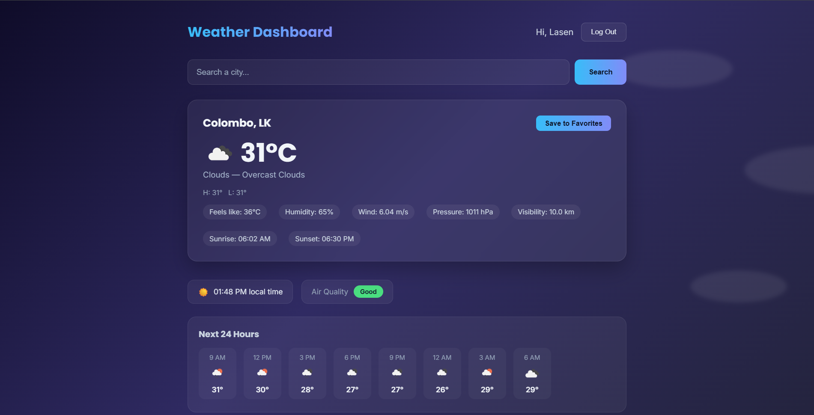
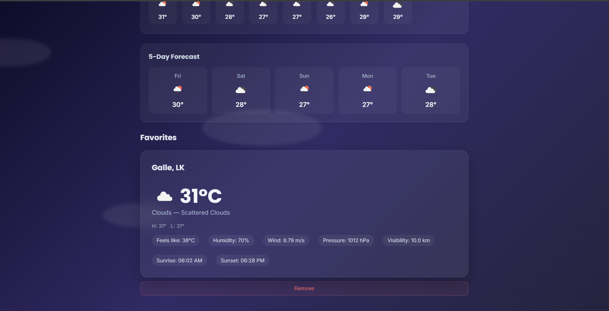

# Weather Dashboard

A full-stack web application where users can create an account, search for real-time weather in any city, and save their favorite cities to a personal dashboard for quick access.

## Introduction

After signing up and logging in, a user can search any city name to see its current weather — temperature, condition, humidity, wind speed, pressure, visibility and sunrise/sunset times — along with an hourly forecast for the next 24 hours and a 5-day outlook. They can also check the city's live Air Quality Index and local time. Any city they search can be saved to a "Favorites" list, which stays linked to their account and reloads automatically the next time they log in. The background of the dashboard changes with subtle animations (rain, snow, clouds, sun, etc.) to match the current weather condition being viewed.

## Live Demo
- **Frontend:** https://weather-dashboard-1-0ppf.onrender.com
- **Backend API:** https://weather-dashboard-ggz9.onrender.com

## Features
- **Authentication** — signup/login with JWT tokens and bcrypt-hashed passwords; protected routes so users can only see and manage their own data
- **Live weather search** — pulls real-time data from the OpenWeatherMap API for any city
- **Favorites** — add/remove cities to a personal list, persisted in MongoDB per user
- **Forecasts** — 24-hour hourly breakdown and a 5-day outlook, both from OpenWeatherMap's forecast endpoint
- **Air Quality Index** — color-coded AQI badge for the searched city
- **Local time & day/night indicator** — calculated from the city's UTC offset
- **Condition-based animated backgrounds** — rain, snow, clouds, clear skies, thunderstorms and mist all render differently
- **Responsive dark UI** — built with plain CSS, no UI framework

## Tech Stack
| Layer | Technology |
|---|---|
| Frontend | React (Vite), React Router, Axios |
| Backend | Node.js, Express |
| Database | MongoDB Atlas + Mongoose |
| Auth | JWT (JSON Web Tokens), bcrypt |
| External API | OpenWeatherMap (current weather, 5-day forecast, air pollution) |
| Deployment | Render — Web Service (backend) + Static Site (frontend) |

## Project Structure
```
weather-dashboard/
├── backend/
│   ├── server.js
│   ├── models/          # User, FavoriteCity (Mongoose schemas)
│   ├── routes/           # auth.js, weather.js
│   └── middleware/       # JWT verification
└── frontend/
    ├── src/
    │   ├── pages/         # Login, Signup, Dashboard
    │   ├── components/    # SearchBar, WeatherCard, ForecastStrip, etc.
    │   ├── context/        # AuthContext (login state)
    │   └── api/            # Shared Axios instance
```

## API Endpoints (Backend)
| Method | Endpoint | Description | Auth Required |
|---|---|---|---|
| POST | `/api/auth/signup` | Create a new account | No |
| POST | `/api/auth/login` | Log in, returns a JWT | No |
| GET | `/api/weather/search?city=` | Get current weather for a city | No |
| GET | `/api/weather/forecast?city=` | Get 5-day/hourly forecast | No |
| GET | `/api/weather/air-quality?lat=&lon=` | Get AQI for coordinates | No |
| GET | `/api/weather/favorites` | List the logged-in user's favorites | Yes |
| POST | `/api/weather/favorites` | Save a city to favorites | Yes |
| DELETE | `/api/weather/favorites/:id` | Remove a saved city | Yes |

## Running Locally

**1. Clone the repo**
```bash
git clone https://github.com/Lasen-Kulanaka/Weather-Dashboard.git
cd Weather-Dashboard
```

**2. Backend setup**
```bash
cd backend
npm install
```
Create a `.env` file inside `backend/` with:
```
MONGO_URI=your_mongodb_connection_string
JWT_SECRET=any_random_secret_string
WEATHER_API_KEY=your_openweathermap_api_key
```
Then start the server:
```bash
node server.js
```

**3. Frontend setup** (in a separate terminal)
```bash
cd frontend
npm install
npm run dev
```
The app will be available at `http://localhost:5173`, connecting to the backend at `http://localhost:5000`.

## Screenshots

**Login Page**


**Dashboard**

